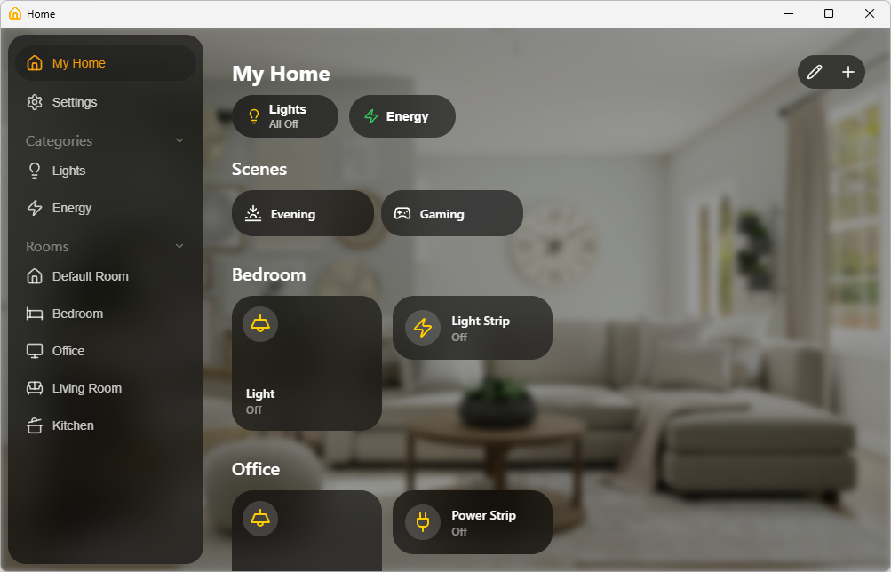
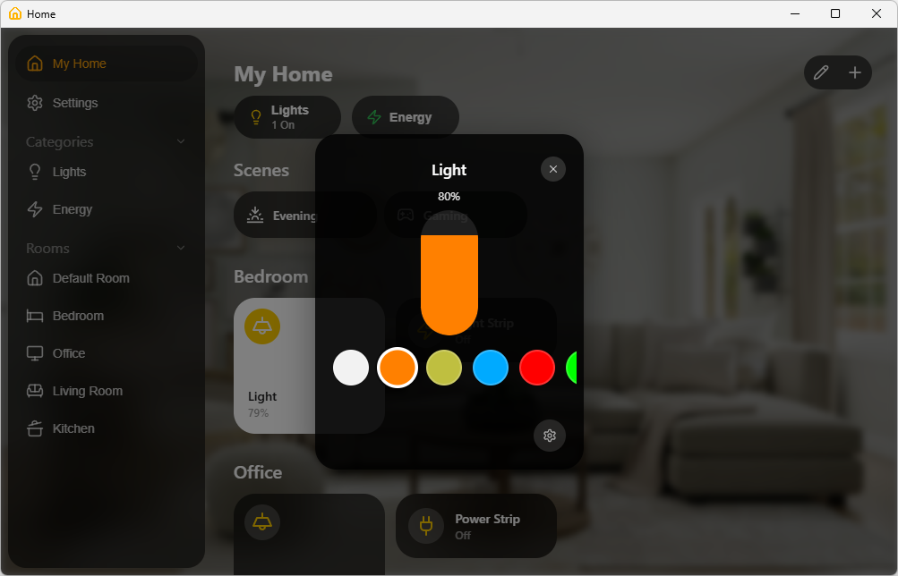

# home-app

An alternative for Windows or Linux to manage your Matter accessories with an experience similar to the Apple Home app.

## Features

- Pair and control Matter accessories
- Organize accessories into rooms with custom names, reorder them, and mark favorites for quick access
- Create and activate scenes to control multiple devices at once
- Customize the experience with dark/light themes
- Import and export your configuration

## Screenshots

## Supported Device Types

- **Lights** — White-only and colored bulbs, brightness and color control
- **Plugs** — On/off control with cumulative energy monitoring

## Pairing a Device

If your accessory is already paired with the Apple Home app:

1. Open the Apple Home app on your iPhone, iPad, or Mac
2. Tap the accessory you want to share
3. Tap the settings icon (gear) or the info button
4. Scroll down and tap **Turn On Pairing Mode**
5. A setup code (manual pairing code) will be displayed
6. In home-app, tap the **+** button and enter the setup code

The accessory will be added to home-app while remaining paired with Apple Home as well.

## Credits

- Default background image by [Unsplash](https://unsplash.com/photos/1616486338812-3dadae4b4ace)
